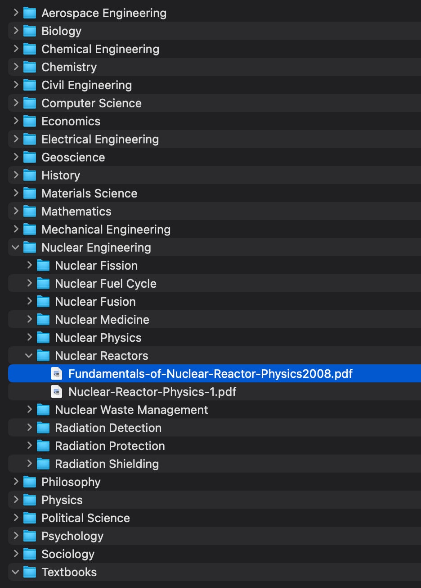

# txtscrpr



## Purpose
If you wake up and feel like attempting to master every topic ever, this repo is a good place to start. It contains a script that scrapes ~1500 textbooks from the internet. The textbooks are organized by topic and subtopic.

Instead of buying my friend an expensive hardcopy textbook for his birthday, I thought it would be a good idea to write a script that would scrape 1500 textbook pdfs from the internet. This way, he can have access to a wide range of textbooks for free. Lots of other people liked the motivation behind this and wants a way to reproduce the ~15GB of textbooks. So, I decided to make this repo public.

I should add that you can't "master" each topic without the external tools the subject is based on. You need to get familiar and practice using softwares like AutoCAD for mechanical engineering and the software licensing isn't included in this repo. You have all the formulas, textbook pdf knowledge, and roots to expand on your personal knowledge graph but don't assume this will *literally* make you a faster of all subjects in each field.

## How to use (python version >= 3.8)

**Linux / MacOS**

```
git clone https://github.com/Infatoshi/txtscrpr.git
cd txtscrpr
python -m venv venv
source venv/bin/activate
pip install -r requirements.txt
python main.py
```

**Windows**

```
git clone https://github.com/Infatoshi/txtscrpr.git
cd txtscrpr
python -m venv venv
"./venv/Scripts/activate"
pip install -r requirements.txt
python main.py
```

Expect roughly 15GB of textbooks to be downloaded to the `topics` directory.
The variable `first_n_results` in main.py can be adjusted. For example, setting `first_n_results = 10` will download the first 10 textbooks from the internet in each subtopic within each topic.
Feel free to edit `topics.json` to include/change/delete more topics and subtopics. It should give you an idea about the topics and subtopics structure.
The scraper is somewhat robust and will receive upgrades over time. It took me roughly 6 hours to reproduce the ~15GB of textbooks on my machine.

## Extra
I plan on adding advanced features to this repo (eg. chatting with textbooks via RAG networks, summarizing textbooks, etc.). If you have any ideas, feel free to open an issue or reach out to me. (links at the bottom)

[Map of Engineering](https://twitter.com/DominicWalliman/status/1522525405391036427/photo/1)
Credit goes to *Domain of Science* for the cover image (map of engineering).

## Links
- [Discord](https://discord.gg/893q6n3TB8)
- [LinkedIn](https://www.linkedin.com/in/elliot-arledge-a392b7243/)
- [Twitter](https://twitter.com/elliotarledge)
- [YouTube](https://www.youtube.com/channel/UCjlt_l6MIdxi4KoxuMjhYxg)
- [GitHub](https://www.github.com/Infatoshi)
- [Website](https://elliotarledge.com)
- Email - `elliot@arledge.net`
- Schedule a meeting with me [here](https://calendly.com/elliot-ayxc/60min)

## Future Ideas

- https://commons.wikimedia.org/wiki/Main_Page - search in the top right and then select "Other Media"  for example: https://commons.wikimedia.org/w/index.php?search=psychology&title=Special:MediaSearch&go=Go&type=other

- https://annas-archive.org/ - massive collection of books and papers

- https://sci-hub.se/ is also good if you have a DOI of a scientific paper you're trying to track down

- implement RAG to chat with textbooks

- use tools like GPT4o to extract highest quality pieces of information from textbooks for other use cases
